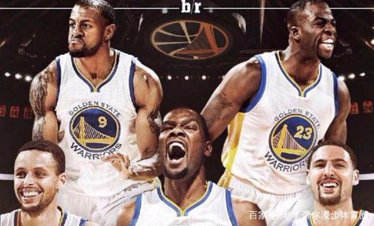
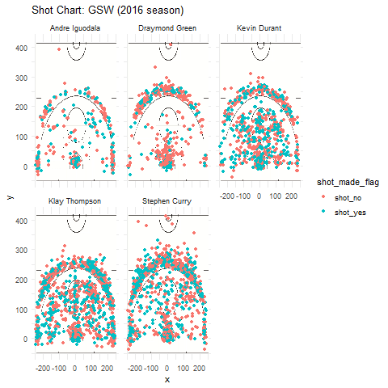
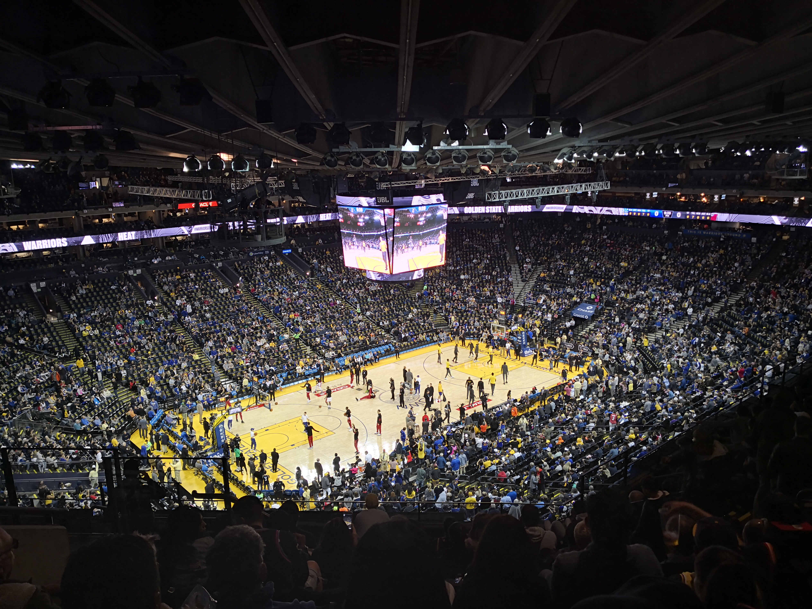

```{r setup, include=FALSE}
knitr::opts_chunk$set(echo = TRUE)
```

```{r}
library(dplyr)
library(ggplot2)
library(scales)

shotsdata<-read.csv('../data/shots-data.csv')
twotry<-table(filter(shotsdata,shotsdata$shot_type=="2PT Field Goal")$name)
twomade<-filter(filter(shotsdata,shotsdata$shot_type=="2PT Field Goal"),shot_made_flag=="shot_yes")
twomade<-as.numeric(table(twomade$name))
tablefortwo<-data.frame(twotry)
colnames(tablefortwo)=c("name","total")
tablefortwo<-mutate(tablefortwo,made=twomade)
tablefortwo<-mutate(tablefortwo,perc_made=percent(made/total))
tablefortwo<-arrange(tablefortwo,desc(perc_made))
tablefortwo

threetry<-table(filter(shotsdata,shotsdata$shot_type=="3PT Field Goal")$name)
threemade<-filter(filter(shotsdata,shotsdata$shot_type=="3PT Field Goal"),shot_made_flag=="shot_yes")
threemade<-as.numeric(table(threemade$name))
tableforthree<-data.frame(threetry)
colnames(tableforthree)=c("name","total")
tableforthree<-mutate(tableforthree,made=threemade)
tableforthree<-mutate(tableforthree,perc_made=percent(made/total))
tableforthree<-arrange(tableforthree,desc(perc_made))
tableforthree

totaltry<-table(shotsdata$name)
shotsmade<-filter(shotsdata,shot_made_flag=="shot_yes")
totalmade<-as.numeric(table(shotsmade$name))
tableforall<-data.frame(totaltry)
colnames(tableforall)=c("name","total")
tableforall<-mutate(tableforall,made=totalmade)
tableforall<-mutate(tableforall,perc_made=percent(made/total))
tableforall<-arrange(tableforall,desc(perc_made))
tableforall
```


```{r eval=FALSE}
#motivation and introduction
The Golden State Warriors is th best team in NBA since 14-15 Season, any word to praise GSW is definitely beyond desciption. As a fan and a writer from Oakland "local sport agency", I have to analysis Warriors's success these years to find out what makes GSW so great.
#background
The new "Hampton Five" formed at the end of 15-16 Season, when Lebron beat the GSW via unfare referee's suspension on Draymond Green on the fifth final, which led to the low morale and a downturn of the so-called "North Carolina Eagle", Harrison Barnes, who misses infinite threes in the last two finals. Since then, GSW tried to inhance their weakness at SF. Fortunately, as the loser of Western Conference Final, the Oklahoma City Thunder's Big Bodss, Kevin Durant, was convinced to join GSW after Draymond Green's "phonecall recruiting". You know what happened after that: two championships in a row and swept away the Cavaliers last year, what a magnificant, splendid revenge!
#data
OK, back to our thesis. During 16-17 Season, the GSW played "normal", but still won 67 games, the new "Hampton Five" was the main reason why they played so well. To make it clear, I list the Effective shooting percentage of them.


```


```{r}
library(dplyr)
library(ggplot2)
library(scales)

shotsdata<-read.csv('../data/shots-data.csv')
twotry<-table(filter(shotsdata,shotsdata$shot_type=="2PT Field Goal")$name)
twomade<-filter(filter(shotsdata,shotsdata$shot_type=="2PT Field Goal"),shot_made_flag=="shot_yes")
twomade<-as.numeric(table(twomade$name))
tablefortwo<-data.frame(twotry)
colnames(tablefortwo)=c("name","total")
tablefortwo<-mutate(tablefortwo,made=twomade)
tablefortwo<-mutate(tablefortwo,perc_made=percent(made/total))
tablefortwo<-arrange(tablefortwo,desc(perc_made))
tablefortwo
```

```{r eval=FALSE}
You see(I know this data is not very true because I've looked up in <https://www.basketball-reference.com/players/c/curryst01.html> but no correspongding 3 made, Stephen Curry never made exactly 280 threes even till now), they made such a good shooting percentage in field goals, even the three's! For instance, Andre Iguodala made 134 of 210 in the whole season, with the effective shooting % of 63.8%! You know, this kind of shooting percentage ususally comes from a center like JaVale McGee or DeAndre Jordan, but Andre Iguoodala is a forward! Likewise, KD got 390 of 643, which is also above 60%, so incredible! No wonder KD is the second best player in League(I personally think Stephen Curry as the best but I know that Lebron James won't agree with me lol)! As a SF, KD has the body near 7 foot and armspread over 7'6'', he is really a monster in the SF world, so he can always make middle distance field goals because no one can defend him without change position or double team(up). What really surprises me is that Stephen Curry made 304 out of 563, also as 54%. We always know that Stephen is famous for his threes, especailly 402 threes in Season 15-16, but he did a great job in two points as well! Klay, as usual, played as a spot up shooter, aka catch and shoot player, got 329 of 640, which is very decent. Draymond Green is an organizer on court, so he did not shoot quite well, but his meaning to the GSW could not simply valued by points, but by defense and assists.


```

```{r}
library(dplyr)
library(ggplot2)
library(scales)

shotsdata<-read.csv('../data/shots-data.csv')
threetry<-table(filter(shotsdata,shotsdata$shot_type=="3PT Field Goal")$name)
threemade<-filter(filter(shotsdata,shotsdata$shot_type=="3PT Field Goal"),shot_made_flag=="shot_yes")
threemade<-as.numeric(table(threemade$name))
tableforthree<-data.frame(threetry)
colnames(tableforthree)=c("name","total")
tableforthree<-mutate(tableforthree,made=threemade)
tableforthree<-mutate(tableforthree,perc_made=percent(made/total))
tableforthree<-arrange(tableforthree,desc(perc_made))
tableforthree

```


```{r eval=FALSE}
Now,let's look at threes. Klay Thomspson was made for shooting threes, he was just like a machine, could shoot all the vacancy threes, he made 246 out of 580! Stephen Curry deflated his 3 points attempt due to the appearance of KD, but still got 280 of 687, keeping his records of above 200 threes every year for 6 consequtive years(8 years in a row if count this year and Season 17-18). KD had 38.6% of threes which was above average among the League that year. Wait, KD had terrifying shooting percentage in 2 points but also good three points? How could anyone stop him from scoring! Andre Iguodala only got 36% with 58 threes made, already enough for him! Draymond Green attepmted 232 threes but only made 74, under 32%, which was not good enough, if he really wants maximum salary, he'd better perform more aggressive not sign Paul Ritchie as his agent!
By combining threes and twos, we get the total effective shooting percentage. Since I've explained enough about twos and threes, I hope I don't need to analysis again.
```

```{r}
library(dplyr)
library(ggplot2)
library(scales)

shotsdata<-read.csv('../data/shots-data.csv')
totaltry<-table(shotsdata$name)
shotsmade<-filter(shotsdata,shot_made_flag=="shot_yes")
totalmade<-as.numeric(table(shotsmade$name))
tableforall<-data.frame(totaltry)
colnames(tableforall)=c("name","total")
tableforall<-mutate(tableforall,made=totalmade)
tableforall<-mutate(tableforall,perc_made=percent(made/total))
tableforall<-arrange(tableforall,desc(perc_made))
tableforall
```

```{r eval=FALSE}
Finally, let's take a glimpse at the hot shot chart of these guys.
```


```{r}

```

```{r eval=FALSE}
Like I've said before, the fire power of GSW focus on Stephen Curry, Klay Thompson, and Kevin Durant. They tried thousands of shooting and made quite a lot. From the hot shot chart of Stephen Curry's, you can see he tried a lot threes even at the half court! I'm firmly believed that even you extend the court graph to the half court, you can still find his threes on that half of the court.
Via Klay Thompson's hot shot graph, we can find that he made so many threes at bottom corners, the 90 degrees arc, and 45 degrees arc. Obviously, the GSW customized many tactics around him, not like Stephen Curry, shooting wherever he like.
KD's hot spot graph is like a masterpiece, and fulfill people's dream of an ideal player: a monster at the painted field, decent feeling at middle distance, and good three shooting skills! Perfect!
In a nutshell, the hampton five's succeess have some reasons: the shooters have so great shooting percentage. It's not like every team can set up "five short players" and achieve the championship. First, they need a historical level like Stephen Curry, Klay Thompson, Ray Allen, Reggie Miller; second,an insider monster with nice threes, like Kevin Durant and Giannis Antetokounmpo; third, good defenders, which is most likely to get. As far as I know, the only obstacles to the GSW are age and "salary cap". I really hope the Golden State Warriors can win the championship this year, another three championships in a row! Forming a dynasty just like 91-93, 96-98 Bulls or 00-02 Laers. Go Warriors!
```

```{r}

```


```{r eval=FALSE}
reference:
  [the hampton5](https://www.nba.com/video/2018/05/06/20180506-gametime-hampton-5)
  [the photo source of hampton5](http://baijiahao.baidu.com/s?id=1602965204264106982&wfr=spider&for=pc)
```


